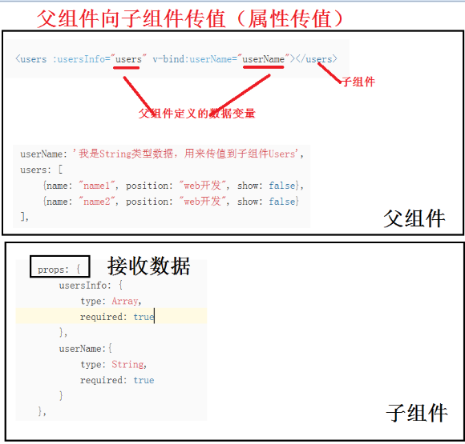
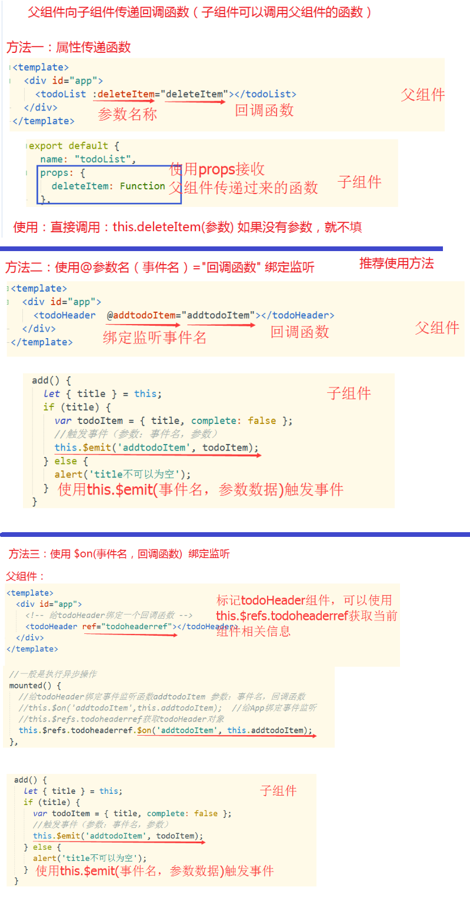
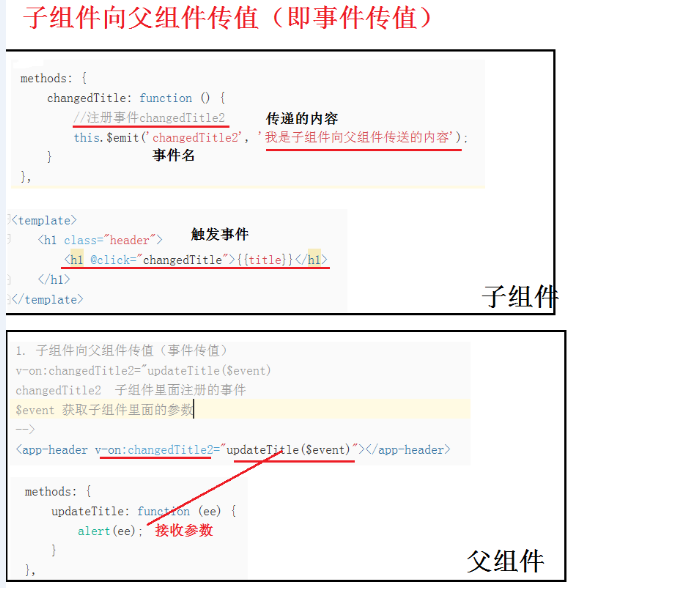
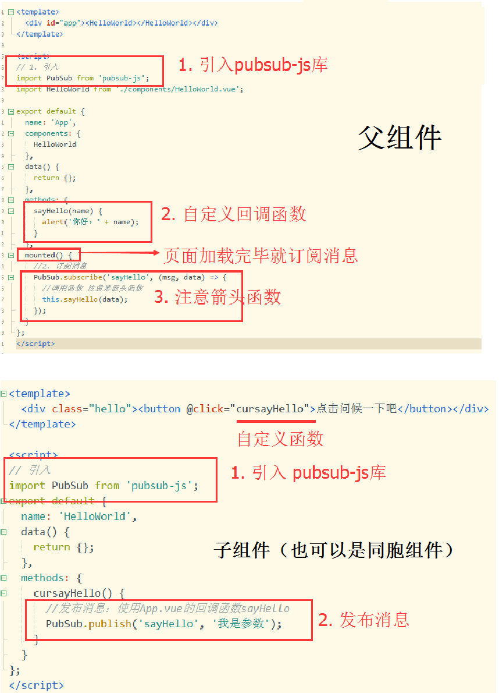

# 组件间通信有5中方式
    props
    vue的自定义事件
    pubsub第三方库
    slot
    vuex  

# props通信：父组件向子组件传值
    Prop是父组件用来传递数据的属性
    父组件的数据需要通过props将数据传递给子组件，而子组件需要显式的用props声明prop
    Prop是单向绑定的，当父组件的属性发生变化时，将传导给子组件，但是反过来不会
    

# 父组件向子组件传递函数

# vue的自定义事件传值（子组件向父组件传值）
    子组件与父组件的通信方式
    用来取代function props
    不适合隔层组件和兄弟组件间的通信
    注册事件：this.$emit('事件名',参数)

        

# pubsub：消息订阅与发布
     需要安装 PubSubJS库，可以实现任意组件之间的通信（父子或同胞兄弟之间）
     安装下载 cnpm install --save pubsub-js
     判断是否安装成功 cnpm info pubsub-js

#### 订阅消息（绑定事件监听）:定义函数或方法
PubSub.subscribe('方法名',(msg,data)=>{} )

#### 发布消息（触发事件）：调用函数或方法
    PubSub.publish('方法名',data)
     

# slot
    通信是带数据的标签
    注意: 标签是在父组件中解析
# vuex：详见Vuex总结 
    多组件共享状态(数据的管理)
    组件间的关系也没有限制
    功能比pubsub强大, 更适用于vue项目
    
     
